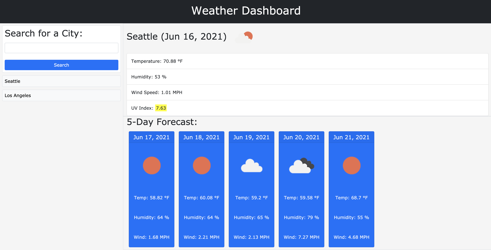
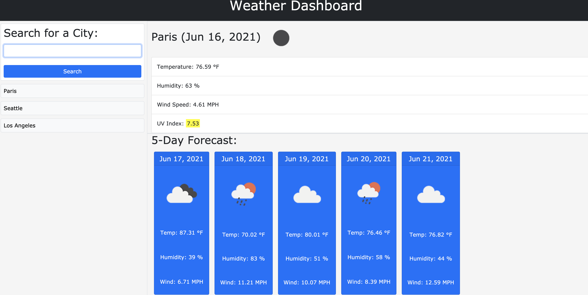

# weather-dashboard  https://banuayozturk.github.io/weather-dashboard/
## Deployed Application:

## Description: 

Weather-dashboard is an application which allows the user to search for weather conditions. User enters the city of the name and current and future conditions for the city appears on the screen. In my project, these conditions are  temperature, uv index, humidity, wind-speed, icon represantation of weather and the date.

Also, user can click on a search history to update the information.

With this project, I aimed to learn how to use a Web Api in a project. It has been a good experience to see how the functionality can be extended with this technology. 

## Screenshot

## Credits/Libraries
 [openweathermap.org](https://openweathermap.org/api/)

 [w3schools Web API's](https://www.w3schools.com/js/js_api_intro.asp)
 
 [Introduction to Web API's](https://developer.mozilla.org/en-US/docs/Learn/JavaScript/Client-side_web_APIs/Introduction)
 

## Contact Me
For any question about the project, please contact me.
[BanuAyozturk](mailto:bnyksl@gmail.com)
